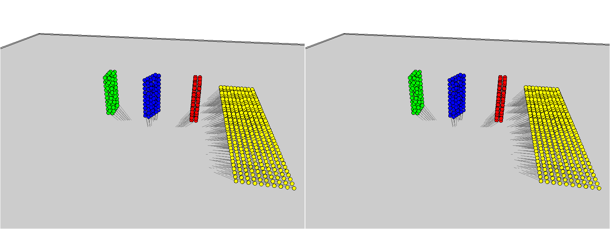
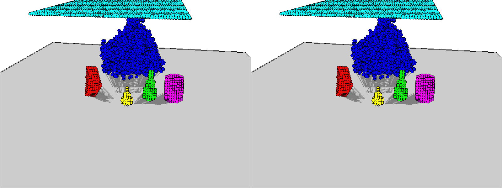

# Physion: Evaluating Physical Prediction from Vision in Humans and Machines [[paper]](https://arxiv.org/pdf/2106.08261.pdf)

Daniel M. Bear, Elias Wang, Damian Mrowca, Felix J. Binder, Hsiao-Yu Fish Tung, R.T. Pramod, Cameron Holdaway, Sirui Tao, Kevin Smith, Fan-Yun Sun, Li Fei-Fei, Nancy Kanwisher, Joshua B. Tenenbaum, Daniel L.K. Yamins, Judith E. Fan

This is the official implementation of particle-based models (GNS and DPI-Net) on the Physion dataset.
The code is built based on the original implementation of DPI-Net (https://github.com/YunzhuLi/DPI-Net).

Contact: sfish0101@gmail.com (Fish Tung)

## Papers of GNS and DPI-Net:

** Learning to Simulate Complex Physics with Graph Networks ** [[paper]](https://arxiv.org/pdf/2002.09405.pdf)

Alvaro Sanchez-Gonzalez, Jonathan Godwin, Tobias Pfaff, Rex Ying, Jure Leskovec, Peter W. Battaglia


** Learning Particle Dynamics for Manipulating
Rigid Bodies, Deformable Objects, and Fluids ** [[website]](http://dpi.csail.mit.edu/) [[paper]](http://dpi.csail.mit.edu/dpi-paper.pdf)

Yunzhu Li, Jiajun Wu, Russ Tedrake, Joshua B. Tenenbaum, Antonio Torralba **

## Demo

Rollout from our learned model (left is ground truth, right is prediction)

**Dominoes**

**Roll**

**Contain**

**Drape**


## Installation

Clone this repo:
```
git clone https://github.com/htung0101/DPI-Net-p.git
cd DPI-Net-p
git submodule update --init --recursive
```

### Install Dependencies if using Conda
For Conda users, we provide an installation script:
```
bash ./scripts/conda_deps.sh
pip install pyyaml
```


To use tensorboard for training visualization
```
pip install tensorboardX
pip install tensorboard
```

### Install binvox
We use binvox to transform object mesh into particles. To use binvox, please download **binvox**
from https://www.patrickmin.com/binvox/, put it under ./bin, and include it in your path with
```
export PATH=$PATH:$PWD/bin.
```
You might need to do **chmod 777 binvox** in order to execute the file.

### Setup your own data path
open **paths.yaml** and write your own path there.
You can set up different paths for different machines under different user name.

## Preprocessing the Physion dataset
**1)** We need to convert the mesh scenes into particle scenes. This line will generate a separate folder
(**dpi_data_dir** specified in **paths.yaml**) that
holds data for the particle-based models
```
bash run_preprocessing_tdw_cheap.sh [SCENARIO_NAME] [MODE]
```
e.g., ``bash run_preprocessing_tdw_cheap.sh Dominoes train`` *SCENARIO_NAME* can be one of the following:
**Dominoes**, **Collide**, **Support**, **Link**, **Contain**, **Roll**, **Drop**, or **Drape**. *MODE* can be either **train** or **test**


You can visualize the original videos and the generated particle scenes with

```
python preprocessing_tdw_cheap.py --scenario Dominones --mode "train" --visualization 1
```
There will be videos generated under the folder **vispy**.

**2)** Then, try generate a train.txt and valid.txt files that indicates the trials you want to use for training and validaiton.
```
python create_train_valid.py
```
You can also design your specific split. Just put the trial names into one txt file.


**3)** For evalution on the red-hits-yellow prediciton, we can get the binary red-hits-yellow label txt file from the test dataset with
```
bash run_get_label_txt.sh [SCENARIO_NAME] test
```
This will generate a folder called **labels** under your output_folder **dpi_data_dir**. In the folder,
each scenario will have a corresponding label file called **[SCENARIO_NAME].txt**

## Training

Ok, now we are ready to start training the models.You can use the following command to train from scratch.

* **Train GNS**
```
    bash scripts/train_gns.sh [SCENARIO_NAME] [GPU_ID]
```
*SCENARIO_NAME* can be one of the following:
**Dominoes**, **Collide**, **Support**, **Link**, **Contain**, **Roll**, **Drop** and **Drape**.


* **Train DPI**
```
    bash scripts/train_dpi.sh [SCENARIO_NAME] [GPU_ID]
```
Our implementation is different from the original DPI paper in 2 ways: (1) our model takes as inputs relative
positions as opposed to absolute positions, (2) our model is trained with injected noise. These two features
are suggested in the GNS paper, and we found them to be critcial for the models to generalize well to unseen
scenes.

* **Train with multiple scenarios**

You can also train with more than one scenarios by adding different scenario to the argument ``dataf``
```
 python train.py  --env TDWdominoes --model_name GNS --log_per_iter 1000 --training_fpt 3 --ckp_per_iter 5000 --floor_cheat 1  --dataf "Dominoes, Collide, Support, Link, Roll, Drop, Contain, Drape" --outf "all_gns"
```

* **Visualize your training progress**

Models and model logs are saved under ``[out_dir]/dump/dump_TDWdominoes.`` You can visualize the training
progress using tensorboard

```
tensorboard --logdir MODEL_NAME/log
```


## Evaluation

* **Evaluate GNS**
```
bash scripts/eval_gns.sh [TRAIN_SCENARIO_NAME] [EPOCH] [ITER] [Test SCENARIO_NAME] [GPU_ID]
```
You can get the prediction txt file under ``eval/eval_TDWdominoes/[MODEL_NAME]``, e.g., ``test-Drape.txt``, which contains results of testing the model on the Drape scenario. You can visualize the results with additional argument ``--vis 1``.

* **Evaluate GNS-Ransac**
```
bash scripts/eval_gns_ransac.sh [TRAIN_SCENARIO_NAME] [EPOCH] [ITER] [Test SCENARIO_NAME] [GPU_ID]
```

* **Evaluate DPI**
```
bash scripts/eval_dpi.sh [TRAIN_SCENARIO_NAME] [EPOCH] [ITER] [Test SCENARIO_NAME] [GPU_ID]
```

* **Evaluate Models trained on multiple scenario**
Here we provide some example of evaluating on arbitray models trained on all scenarios.
```
bash eval_all_gns.sh [EPOCH] [ITER] [Test SCENARIO_NAME] [GPU_ID]
bash eval_all_dpi.sh [EPOCH] [ITER] [Test SCENARIO_NAME] [GPU_ID]
bash eval_all_gns_ransac.sh [EPOCH] [ITER] [Test SCENARIO_NAME] [GPU_ID]
```

* **Visualize trained Models**
Here we provide an example of visualizing the rollout results from trained arbitray models.
```
bash vis_gns.sh [EPOCH] [ITER] [Test SCENARIO_NAME] [GPU_ID]
```
You can find the visualization under ``eval/eval_TDWdominoes/[MODEL_NAME]/test-[Scenario].``
We should see a gif for the original RGB videos, and another gif for the side-by-side comparison of gt particle scenes and the predicted
particle scenes.

## Citing Physion

If you find this codebase useful in your research, please consider citing:

    @inproceedings{bear2021physion,
        Title={Physion: Evaluating Physical Prediction from Vision in Humans and Machines},
        author= {Daniel M. Bear and
               Elias Wang and
               Damian Mrowca and
               Felix J. Binder and
               Hsiao{-}Yu Fish Tung and
               R. T. Pramod and
               Cameron Holdaway and
               Sirui Tao and
               Kevin A. Smith and
               Fan{-}Yun Sun and
               Li Fei{-}Fei and
               Nancy Kanwisher and
               Joshua B. Tenenbaum and
               Daniel L. K. Yamins and
               Judith E. Fan},
        url = {https://arxiv.org/abs/2106.08261},
        archivePrefix = {arXiv},
        eprint = {2106.08261},
        Year = {2021}
    }

